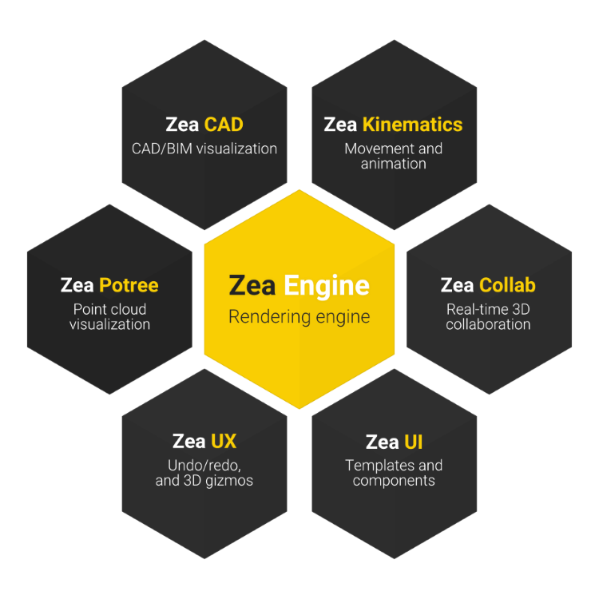

# Zea Engine
Zea Engine is a web-based 3D rendering solution designed from the ground up for CAD and professional graphics, which provides the best in class power, speed and reach for the next generation of web applications. A 3D JavaScript library for innovative manufacturers and industry 4.0 supporters who need to build web applications.

* Power  
Designed with the highest requirements in mind, giving developers a suite of tools to address the toughest challenges in modern professional graphics app development. Zea Engine pushes the limits of what a developer can achieve in the browser by focusing on power and performance.

* Versatility  
No single solution can solve all problems out of the box. Therefore, the Zea Engine uses a modular architecture that enables developers to integrate new functionalities. Zea keeps the essential features in the core while allowing powerful extensions to be built, either by Zea, to expand the engine's scope, or by third parties who wish to develop specific solutions.

* Reach  
Applications that leverage the web browser are already available on all modern devices. These web applications provide a friction-free and straightforward way to deliver content without requiring users to install a player. Zea Engine is designed for the web and enables new categories of high performance and versatile web applications.

 

# Plugins and Tools

No one size fits all. The Zea Engine is designed around a plugin architecture that enables anyone to build and publish plugins that expand capabilities of the engine. We provide a range of plugins and tools to make working with the engine easier and  more productive.

For more information on the templates and plugins see the page on [Templates and Plugins](plugins-and-tools.md)

> [Templates and Plugins](plugins-and-tools.md)

# Licensing
The Zea Engine is open-source. By downloading the Zea Engine, you agree to be bound by the [terms and conditions](https://www.zea.live/en/terms-of-service) of this license.
 
To evaluate the engine with your proprietary content, you will need to access our server-side libraries and a restricted non-commercial evaluation license.

To build a commercial application, you need a commercial licensing agreement.
> For questions on licensing, please fill out the contact form on our website: [_zea.live_](https://www.zea.live/contact-us)

# Get Started

To get started using Zea Engine, you can start by learning the basics of how to setup the engine yourself in the Getting Started guide, or you can jump straight into a full web application using the Svelte template.

> [Getting started with the Zea Engine](getting-started/get-started-with-engine.md)

> [Zea Svelte Template](https://github.com/ZeaInc/zea-svelte-template)

