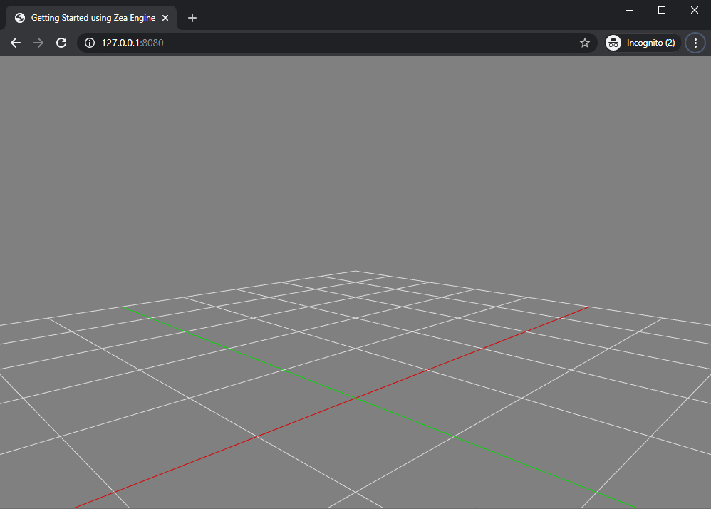
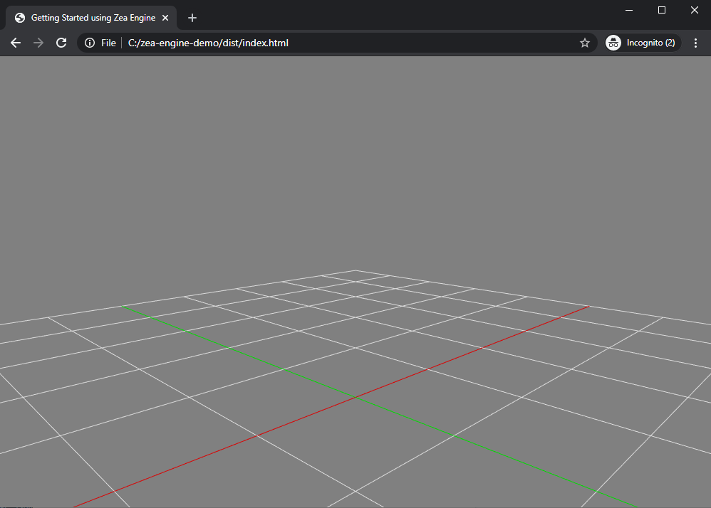

# Getting Started using the engine

Zea Engine is used to build interactive web applications using JavaScript. In this tutorial, we will learn how to load the engine in the browser and set up your first scene.

<div class="glitch-embed-wrap" style="height: 420px; width: 100%;">
  <iframe
    src="https://glitch.com/embed/#!/embed/zea-web-demo?path=index.html&previewSize=100"
    title="zea-web-demo on Glitch"
    allow="geolocation; microphone; camera; midi; vr; encrypted-media"
    style="height: 100%; width: 100%; border: 0;">
  </iframe>
</div>
<br>

## Introduction to NPM and Unpkg

Zea distributes its libraries via NPM. NPM is the world's largest package manager and distributes files for the majority of JavaScript libraries.

> To see the list of pages available from Zea Inc. access the NPM page for Zea:
https://www.npmjs.com/package/@zeainc/zea-engine


### Unpkg.com
Libraries hosted on NPM can be accessed using various techniques, and this tutorial will demonstrate several of them. One of the easiest ways to access packages from NPM is to use tools like Unpkg. Unpkg generates URLs for each file in each package on NPM, making it possible to load into the browser directly without needing to download the entire package.

> For example, the Unpkg URL for the engine on NPM is the following: https://unpkg.com/@zeainc/zea-engine

If you open that URL in the browser, you will see it display the compiled engine's file contents. You may also notice that the URL redirects to contain the full path to the latest version, and in that version, the CommonJS build of the engine.

> https://unpkg.com/@zeainc/zea-engine/dist/index.umd.js

#### Accessing the latest ES6 Module

In this tutorial, we will start by loading the engine directly off Unpkg as an ES6 Module. Within the engine dist folder, there are two build files. A CommonJS build, and an ESM build. Developers should use the ESM build.

To load this file, you can specify the path within the package.

https://unpkg.com/@zeainc/zea-engine/dist/index.esm.js

> Note: we omitted the version number, which means we default to the latest version. Initially, that is fine, but you will need to download the packages to your system for more control over which version you wish to load. Downloading the packages is covered later in the tutorial.


## Basic Setup
First, let's create a directory for our demo project:

```sh
> mkdir zea-engine-demo
> cd zea-engine-demo
```

*Throughout the Guides we will use diff blocks to show you what changes we're making to directories, files, and code.*
*Now we'll create the following HTML file and its contents:*

**project**

```diff
 zea-engine-demo
 + |- index.html
```

**Index.html**
 
```html
<!doctype html>
<html>
  <head>
    <title>Getting Started using Zea Engine</title>
  </head>
 <body>
    <div id="app"></div>
  </body>

  <script crossorigin src="//cdn.jsdelivr.net/combine/npm/@zeainc/zea-engine"></script>
  <script type="module">
    const { Scene, GLRenderer } = globalThis.zeaEngine
  </script>
</html>
```

Zea Engine is exported using [UMD](https://github.com/umdjs/umd) module format, which is intended to work everywhere(Client or Server).
When importing the script in your html, it will setup the "zeaEngine" object in the global scope, which is accessible through `window` or `globalThis` objects.


The module script allows us to directly import classes defined in the engine into the scope of the running script. 

```javascript
const { Scene, GLRenderer } = globalThis.zeaEngine
```
Now, we can use the classes of the engine to leverage our development.
 
```javascript
// Retrieves the div from the DOM tree that the renderer will attach the canvas element to.
const domElement = document.getElementById("app");

// Constructs the Scene object that will own all the data.
const scene = new Scene();

// A helper function creates a grid with size 10.0 and with 10 subdivisions in each direction. 
scene.setupGrid(10.0, 10);

// Constructs the renderer, providing the DOM element retrieved earlier.
const renderer = new GLRenderer(domElement);

// Connecting the Renderer to the scene so that the renderer starts to render the scene.
renderer.setScene(scene);
```


# Setting up a src directory

```diff
 zea-engine-demo
  |- package.json
  |- index.html
+ |- /src
+   |- index.js
```

**src/index.js**

```javascript
const { Scene, GLRenderer } = globalThis.zeaEngine
 
const domElement = document.getElementById("app");
 
const scene = new Scene();
scene.setupGrid(10.0, 10);
 
const renderer = new GLRenderer(domElement);
renderer.setScene(scene);
renderer.resumeDrawing();
```

> "../node_modules/@zeainc/zea-engine/dist/index.esm.js"

The module path now needs to resolve up one folder before traversing down into the node_modules folder.
 
**index.html**
```diff
<!doctype html>
<html>
  <head>
 
    <title>Getting Started using Zea Engine</title>
    <script src="https://unpkg.com/@zeainc/zea-engine/dist/zea-engine.js"></script>
  </head>
  <body>
    <div id="app"></div>
+    <script type="module" src="src/index.js"></script>
-  <script type="module">
-
- const { Scene, GLRenderer } = globalThis.zeaEngine

- const domElement = document.getElementById("app");

- const scene = new Scene();
- scene.setupGrid(10.0, 10);

- const renderer = new GLRenderer(domElement);
- renderer.setScene(scene);
- renderer.resumeDrawing();
-
-  </script>
</html>
```

**Running a server**
The HTML file can no longer run without a local server running. ES6 modules are subject to the same-origin policy. You need to run your script from a local server, opening the file directly with a browser will not work.


**Install the server Globally via NPM**
npm install --global http-server
Now you can run the server in the folder of the demo.

```bash
> http-server
Starting up http-server, serving ./
Available on:
  http://192.168.2.24:8080
  http://127.0.0.1:8080
```

Loading the given URL in the browser should now generate the following result.




# Installing Engine Locally
As a project grows, it becomes preferable to use NPM to manage downloading packages for us. To start using npm, initialize the package.json file and add the engine as one of the dependencies.

```
npm init -y
npm install @zeainc/zea-engine
```

We also need to adjust our package.json file to make sure we mark our package as private and remove the main entry. Removing the main extry will prevent an accidental publish of your code.
If you want to learn more about the inner workings of package.json, we recommend reading the npm documentation.

**package.json**
```diff
 {
    "name": "zea-engine-demo",
    "version": "1.0.0",
    "description": "",
    "private": true,
    "scripts": {
      "test": "echo \"Error: no test specified\" && exit 1"
    },
    "keywords": [],
    "author": "",
    "license": "ISC",
    "dependencies": {
      "zea-engine": "^1.3.0",
    },
  }
```
Now we can modify the html file to load directly out of the local node modules folder.
 
**index.js**
```diff
import { 
  Scene,
  GLRenderer 
-} from "https://unpkg.com/@zeainc/zea-engine/dist/index.esm.js"
+} from "../node-modules@zeainc/zea-engine@/dist/index.esm.js"
```
Instead of loading zea-engine off the Unpkg servers, we'll load it from a local system. Loading from a local system gives more control over which version we use, and means all data is served from a controlled environment.

*Note: After downloading and extracting the 'getting-started-2.zip' archive, you will need to run 'npm install' in the folder to cause npm to download the engine package specified in the package.json file.*

# Using Webpack to bundle the engine
Webpack is used to compile JavaScript modules and is a popular tool in web development. For more information on getting started using Webpack, we recommend reading follow the following tutorial: https://webpack.js.org/guides/getting-started/ 

**Install the webpack-cli (the tool used to run webpack on the command line):**

```sh
> npm install webpack webpack-cli --save-dev
```

First, we'll adjust our directory structure, separating the "source" code (/src) from our "distribution" code (/dist). The "source" code is the code that we'll write and edit. The "distribution" code is the minimized and optimized output of our build process that will load in the browser. Adjust the directory structure as follows:

**project**

```diff
  |- package.json
+ |- /dist
+   |- index.html
- |- index.html
  |- /src
    |- index.js
```

**src/index.js**

```diff
import { 
  Scene,
  GLRenderer 
- } from "./node_modules/@zeainc/zea-engine/dist/index.esm.js"
+ } from "@zeainc/zea-engine"

const domElement = document.getElementById("app");
 
const scene = new Scene();
scene.setupGrid(10.0, 10);
 
const renderer = new GLRenderer(domElement);
renderer.setScene(scene);
renderer.resumeDrawing();
```

Now that Webpack will bundle the scripts, the import statement needs to be modified.
The Webpack bundling tool knows that installed modules are in the node_modules folder and to remove that from the beginning of the path. Webpack then opens the package.json file and reads where to find the script file in the dist folder,  so we can now remove that part.
Now, since we'll be bundling our scripts, modify the other script tag to load the bundle, instead of the raw /src file:

**dist/index.html**
```diff
 <!doctype html>
  <html>
   <head>
    <title>Getting Started using Zea Engine</title>
   </head>
   <body>
    <div id="app"></div>
-    <script src="./src/index.js"></script>
+    <script src="main.js"></script>
   </body>
  </html>
```

By stating what dependencies a module needs, Webpack can use this information to build a dependency graph. It then uses the graph to generate an optimized bundle where scripts will be executed in the correct order.
With that said, let's run npx Webpack, which will take our script at src/index.js as the entry point, and generate dist/main.js as the output:

```sh
> npx webpack
Hash: 566904c80f5d19766290
Version: webpack 4.43.0
Time: 4401ms
Built at: 2020-07-15 10:36:11 a.m.
  Asset     Size  Chunks                    Chunk Names
main.js  852 KiB       0  [emitted]  [big]  main
Entrypoint main [big] = main.js
[1] ./src/index.js 277 bytes {0} [built]
[3] (webpack)/buildin/harmony-module.js 573 bytes {0} [built]
[5] (webpack)/buildin/global.js 472 bytes {0} [built]
    + 6 hidden modules

WARNING in configuration
The 'mode' option has not been set; Webpack will fallback to 'production' for this value. Set 'mode' option to 'development' or 'production' to enable defaults for each environment.
You can also set it to 'none' to disable any default behavior. Learn more: https://webpack.js.org/configuration/mode/

WARNING in asset size limit: The following asset(s) exceed the recommended size limit (244 KiB). Larger asset sizes can impact web performance.
Assets:
  main.js (852 KiB)

WARNING in entrypoint size limit: The following entrypoint(s) combined asset size exceeds the recommended limit (244 KiB). Larger asset sizes can impact web performance.
Entrypoints:
  main (852 KiB)
      main.js


WARNING in Webpack performance recommendations:
You can limit your bundles' size by using import() or require.ensure to lazy load some parts of your application.
For more info visit https://webpack.js.org/guides/code-splitting/
```
 
Your output may vary slightly, but if the build is successful, you are good to go. Also, don't worry about the warning, we'll tackle that later.
Open index.html in your browser and, if everything went right, you should see the following:

> Note: webpack has transpiled the es6 modules into standard javascript, which does not have the Same Origin policy enforced on es6 modules. 
> This means you can > load the HTML file directly without running the server. However, if you still have the server running, you can also use the served url.
> http://127.0.0.1:8080/dist/

If you are getting a syntax error in the middle of minified JavaScript when opening index.html in the browser, set development mode and run npx webpack again. This is related to running npx webpack on latest Node.js (v12.5+) instead of LTS version.



<div class="download-section">
  <a class="download-btn" title="Download"
    onClick="downloadTutorial('getting-started-3.zip', ['./getting-started/zea-engine-demo-3/package.json', './getting-started/zea-engine-demo-3/dist/index.html', './getting-started/zea-engine-demo-3/src/index.js', './getting-started/zea-engine-demo-3/webpack.config.js'])" download>
    Download
  </a>
</div>
<br>

> Note: After downloading and extracting the 'getting-started-3.zip' archive, you will need to run the following commands in the folder
> 1. 'npm install'
> 2. 'npx webpack'


# Conclusion

Now that you have a basic web application working, you can move onto adding geometries to to the scene.

 * [Getting Started with Zea CAD](https://zea.live/zea-cad/#/getting-started/get-started-with-zea-cad)
 * [Load a Point Cloud](http://zea.live/zea-pointclouds/#/tutorials/load-a-point-cloud)
