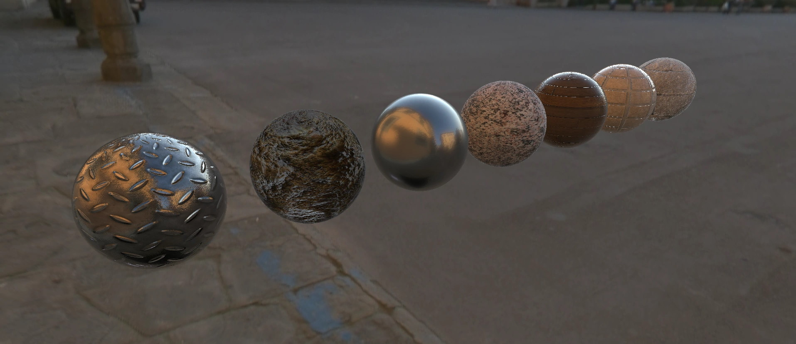
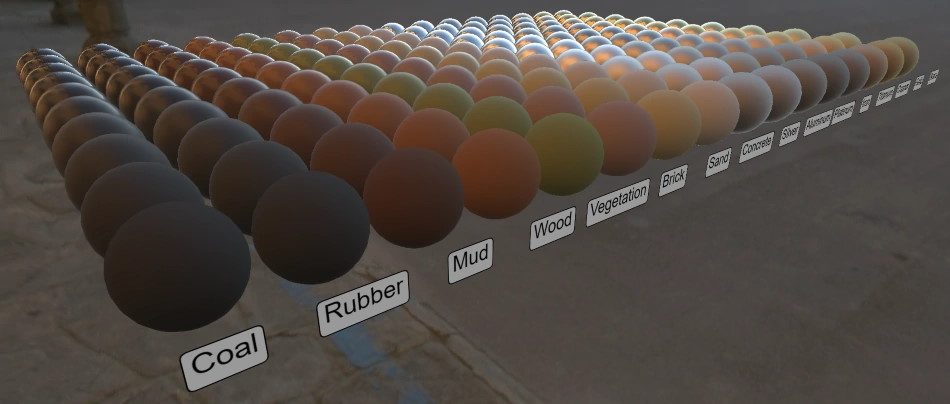

# PBR Rendering




PBR Rendering is an advancement in lighting algorithms that provides a very realistic response to lighting that mimics the real responses of materials. Zea Engine comes proves Physically Based Rendering pipeline based on the GGX BRDF. 


Zea Engine PBR renderer is designed to provide a basic, yet beautiful renderer that can make products look nice under simple Image based lighting. Zea is not trying to build a renderer to compete with high end game engines like Unity or Unreal. At this time, there is no plans to support analytical lights and shadows or reflections. 

What it does do, is enable you to setup scenes quickly that look nice with minimal effort.


# HDR Environment Maps

When Zea was first being developed, there was no HDR file format specifically developed for the web. There was some interesting research available on how to encode HRD images for the web, and so we took the Boost HDR technique, expanded it a little, and used it to create our own custom HDR file format for Zea Engine. The file is simply an archive that contains 2 files that get combined in the GPU to provide a high quality HDR image in the browser. 

Boost HDR provides better compression than ny standard HDR encoding that we have seen. It will be possible that we can add support for other encodings, sach as HDRE, but for now, this is the only format we support. 

## Producing your own zenv Images

We make available a free tool to convert images from Lat-Long HDR to zenv and would be happy to provide it to you. 

> Please fill out the contact form on our website if you are interested in checking out the ZEnv converter tool: [_zea.live_](https://www.zea.live/contact-us)

*We will make this tool available through our marketplace as soon as it is up and running.*


# Materials Parameters




The Material parameters provided by Zea Engine are a subset of those found in Unity and line up with the material parameters provided by Filament. You can use the Filament material guide to help you understand the material parameters in Zea Engine.


# Resources:

PBR lighting and materials is a huge area in its own right. To achieve high quality results often requires a skilled artist to create textures and lighmaps. To learn more about how Physical Based Rendering can be leveraged to build truely photorealistic images, follow the well wrutten guides on the Filament renderer, and the content on Marmoset.

https://google.github.io/filament/Filament.html#materialsystem/parameterization/craftingphysicallybasedmaterials

https://marmoset.co/posts/physically-based-rendering-and-you-can-too/


For a great library of PBR materials that you can use in Zea Engine, check out the great FreePBR website.
https://freepbr.com/

> Note: these materials are far 

# Adapting Unity Materials for use in Zea Engine

Often the material libraries online provide materials that use huge textures and are in formats that are not efficient. 

1. Convert all PNG, TGA or any other format to webp.
2. Resize to be as small as you need for your project.
3. Any textures that are basically a flat color, you can just skip and replace with a simple value in the material (as shown below)

> Note: webp files are now supported in iOS, so this is not a problem.

```javascript
const material = new Material('surfaces', 'StandardSurfaceShader')

const baseColorTexture = new FileImage('FileImage')
baseColorTexture.load('images/steelplate1-unity/steelplate1_albedo.webp')
material.getParameter('BaseColor').setImage(baseColorTexture)

const baseColorTexture = new FileImage('FileImage')
baseColorTexture.load('images/steelplate1-unity/steelplate1_normal-ogl.webp')
material.getParameter('Normal').setImage(baseColorTexture)

material.getParameter('Roughness').setImage(0.3)
material.getParameter('Metallic').setImage(1.0)
material.getParameter('Metallic').setImage(0.7)
```
