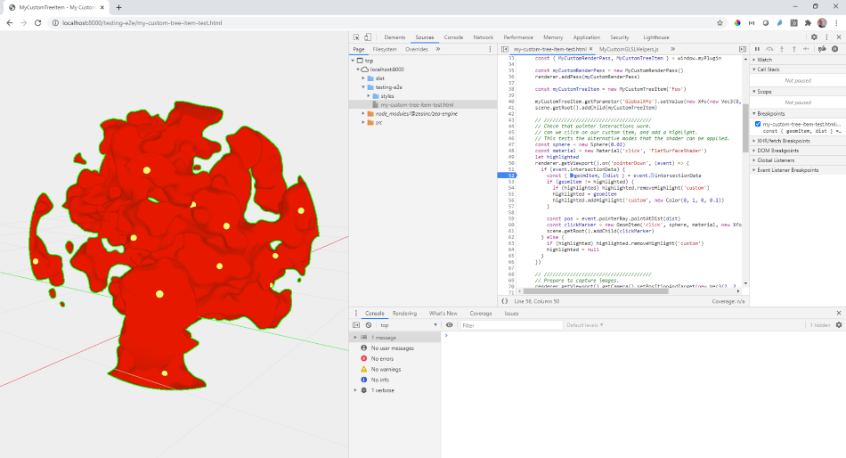
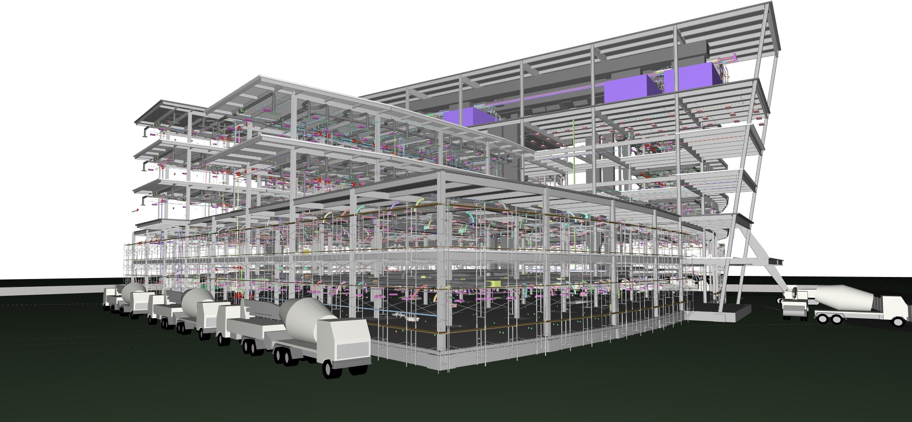

# Templates and Plugins 

The Zea Engine provides a core and basic functionality, and a collection of plugins that extend the functionally of the engine for more specific use cases.

## Zea Svelte Template

Need to get up and running quickly? Zea provides a template application built using the popular new [Svelte](https://svelte.dev/) framework. This Template comes with a library of Svelte components that you can use to customize the application to your own requirements.

the Svelte template combines all of the stock libraries into a single well structured app. It shows how to setup UX, Collab, authentication, CAD rendering, selection etc...

> [https://github.com/ZeaInc/zea-svelte-template](https://github.com/ZeaInc/zea-svelte-template)
> [Svelte](https://svelte.dev/)

## Zea Plugin Template

If you are interested in building your own plugin, or just want to see some sample code on how to extend the engine, check out the plugin template. The goal of the plugin template is to provide a quick start on building your own plugins, using the best practices, such as unit testing, end-to-end testing, and semantic versioning. We use the plugin template when we start working on a new plugin to get up and running quickly.

> [https://github.com/ZeaInc/zea-plugin-template](https://github.com/ZeaInc/zea-plugin-template)

## Zea UX

The UX library provides a collection of plugins and tools for User Experience, such as Undo Redo, Onscreen widgets for moving objects around, and 3d controls to edit scene parameters.

> [Zea UX](https://docs.zea.live/zea-ux/)

## Zea CAD

<!--  -->

To handle loading massive CAD and BIM data sets quickly, Zea provides the CAD plugin that loads and renders large CAD data sets with ease. CAD data is quite different from other kinds of data, and Zea CAD leverages the unique properties of parametric surfaces to reduce load times and increase size limits when loading CAD and BIM data in the browser.

> [Zea CAD](https://docs.zea.live/zea-cad/)

## Zea Collab

One huge benefit of web applications is being able to connect users together for collaboration or presentations. The Zea Collab library provides Client and Server side tools for connecting and synchronizing users.

> [Zea Collab](https://docs.zea.live/zea-collab/)

## Zea Potree

Zea Potree is a plugin for Zea Engine that integrates the powerful [Potree](https://github.com/potree/potree/). Zea Potree enables loading and rendering of massive LiDAR and point cloud data directly in the browser. The integration of Potree into Zea Engine provides a few important improvements, including better performance and reduced battery consumption on mobile devices. When combined with the other powerful features of Zea Engine, like CAD and BIM data loading, Zea Potree can be used for advanced uses cads such as metrology and build inspections.

> [Zea Potree](https://docs.zea.live/zea-potree/)
