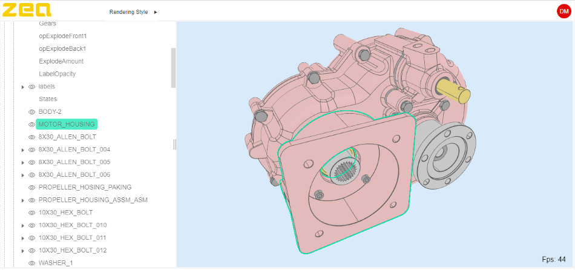

# Plugins and Tools

The Zea Engine provides a core and basic functionality, and a collection of plugins that extend the functionally of the engine for more specific use cases.

## Zea UX

The UX library provides a collection of plugins and tools for User Experience, such as Undo Redo, Onscreen widgets for moving objects around, and 3d controls to edit scene parameters.

> [Zea UX](https://docs.zea.live/zea-ux/)

## Zea User Interfaces Library

Do you need to display a Tree View of your model structure, or provide a simple panel based layout? Zea provides a User interface library built using [Web Components](https://developer.mozilla.org/en-US/docs/Web/Web_Components) which means you can use the library of components with any existing web app framework, such as [ReactJS](https://reactjs.org/), [AngularJS](https://angularjs.org/) or [StancilJS](https://stenciljs.com/). We use Stencil JS for our own web applications.

To complement the Zea Engine, the Zea Web Components library provides a collection of User interface elements that can be used to quickly assemble a rich User Experience.

> [Zea Web Components Library](http://web-components-staging.zea.live)

## Zea CAD

<!--  -->

To handle loading massive CAD and BIM data sets quickly, Zea provides the CAD plugin that loads and renders large CAD data sets with ease. CAD data is quite different from other kinds of data, and Zea CAD leverages the unique properties of parametric surfaces to reduce load times and increase size limits when loading CAD and BIM data in the browser.

> [Zea CAD](https://docs.zea.live/zea-cad/)

## Zea Collab

One huge benefit of web applications is being able to connect users together for collaboration or presentations. The Zea Collab library provides Client and Server side tools for connecting and synchronizing users.

> [Zea Collab](https://docs.zea.live/zea-collab/)

## Zea Pointclouds

Zea Pointclouds is a Proof of Concept plugin that integrates the powerful [Potree](https://github.com/potree/potree/). Zea Pointclouds enables loading and rendering of massive LiDAR and point cloud data directly in the browser. The Zea Pointclouds integration of Potree provides a few important improvements, including better performance and reduced battery consumption on mobile devices. When combined with the other powerful features of Zea Engine, like CAD and BIM data loading, Zea Pointclouds can be used for advanced uses cads such as metrology and build inspections.

> [Zea Pointclouds](https://docs.zea.live/zea-pointclouds/)
