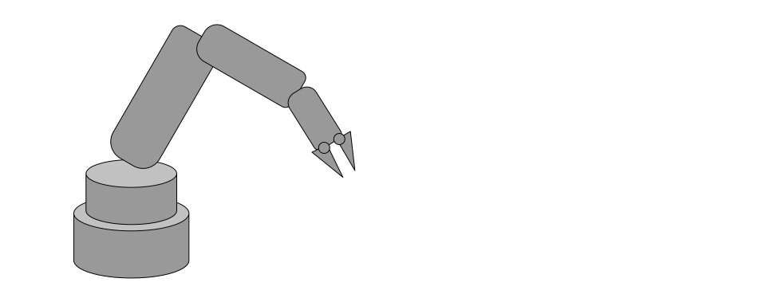

# Transformations

In this document we will cover how transformations are computed and how they are used to control the position, orientation and scale of objects in the 3d scene.



## Tree Structure and hierarchical transformations

Often, in a 3D scene, it is convenient to specify the transformations of scene elements relative to each-other. For instance, items sitting on a table should move along with the table; items in a box should move with the box; and the transformations of the links of a robot arm make sense to write in terms of the transformations of their parent links.
One way to implement this is to think of every object in the scene as having a Transform that indicates its position relative to a parent Transform. Indeed, such a transformation hierarchy ("scene tree") is at the core of many 3D modelling packages.

At the base of the tree we have the scene root, which is a [Tree Item] that all other tree items and geometries are attached to. 

Each child item attached to a tree item inherits the transformation of its parent, and applies an offset to calculate its own global transformation. This ‘Global Xfo’ is the actual position and orientation of the item in the scene.

## Xfos vs Matrices

The Xfo is a value that provides a 3d transformation as 3 components that each specify a different aspect of the transformation. Like matrices, Xfos can be multiplied together and inverted. They can readily be converted to matrices, which is often done in the renderer when providing data to the GPU.

**Xfos**
Xfos are easier to work with, as each of the 3 components of an Xfo can be manipulated independently. If we want to rotate, or scale an object, we can modify the ori, or sc components of its Xfo. Matrices are more difficult to work with when computing movements or animation of parts, and so instead we used Xfos.

**Matrices**
There are some forms of transformations that cannot be expressed using Xfos. For example, projection matrices, or matrices containing sheering cannot be represented in the form of an Xfo. Matrices still have their place within the engine for these reasons.


> Xfos can be converted to Matrices and vice versa. 

```javascript
const xfo = new Xfo();
xfo.tr.set(2, 5, 7);
xfo.sc.set(2, 2, 2);

const mat = xfo.toMat4();

const xfo2 = new Xfo();
xfo2.fromMat4(mat);
```

# “Local Xfo” vs “Global Xfo”


Each tree item in the Scene Tree specifies the offset from its parent using the Local Xfo Parameter. This Xfo Parameters value provides the translation, rotation and scaling offset that the tree item should have relative to the transformation of its parent.

Each tree item also has a ‘Global Xfo’ value, which is computed by combining the parent item global and its own local Xfo. If either the local Xfo changes, or the parent’s Global Xfo changes, the Tree Items own global Xfo will automatically be recalculated. 

We can query any TreeItem for its local Xfo, or computed global Xfo values. This can be useful when writing operators. (see below).

## GeomOffsetXfo

Each 3d application has a different approach to calculating transformations, and Zea Engine aims to provide a method that strikes a balance between the very complex methods used in Film VFX products, and the much simpler methods used in CAD applications or games. 

In many 3D applications, there is an additional transformation applied to geometry called the ‘Pivot Transform’, which allows a piece of geometry to be positioned relative to its own ‘pivot’, or ‘global xfo’ as it is referred to in the scene tree. For example, a simple cylinder might not rotate exactly on its axis, but on an axis that is displaced or rotated from its center. 
The pivot transform value that is exported from these applications is loaded into the Geom Offset Xfo value to ensure the rotations applied directly to the Global Xfo create the correct results.


# Kinematic Operators
Operators are used throughout the scene tree to compute values of parameters based on values of other parameters. As any parameter is modified, if any operators are reading from that parameter, the operators are evaluated and compute the new values for the parameters that the operators are writing to. 

This makes it possible to make objects move in relation to other objects in the scene than just their direct parent. An operator for example could be applied to an object to always stay between 2 other objects, or turn on its axis. 

> For an example, see the Gears Operator


# Summary 

This section covered the basics of the Xfo and how it is used to define the transformations of objects in the 3d scene.

