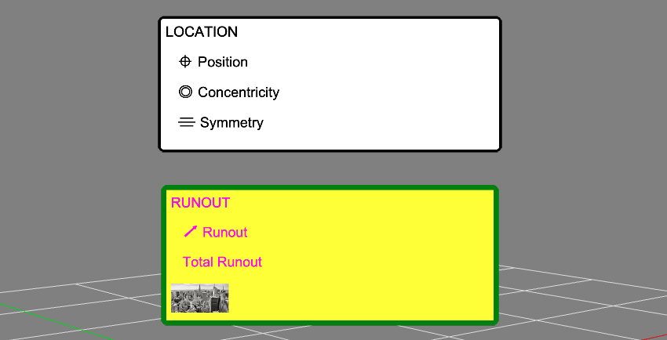

# Styling Labels

ℹ️ Before we begin, please make sure you're already familiar with [labels overview](tutorials/labels).

Labels are styled using [CSS](https://developer.mozilla.org/en-US/docs/Web/CSS). You can define your stylesheets on the page itself or load them from a different site, the Zea Engine will detect them and will use them as needed.

💻 These rules can be used to style a label in white background and black text:

```html
<style type="text/css">
  .my-label--formal {
    background-color: white;
    border: 0.5rem solid black;
    border-radius: 1rem;
    color: black;
    font-size: 3rem;
    padding: 1rem;
  }
</style>
```

📷 Two highly styled labels:



🎥 Live example of two highly styled labels:

[GetStarted0](https://glitch.com/embed/#!/embed/zea-engine-labels?path=src/main.js&previewSize=100&attributionHidden=true ':include :type=iframe width=100% height=800px')
