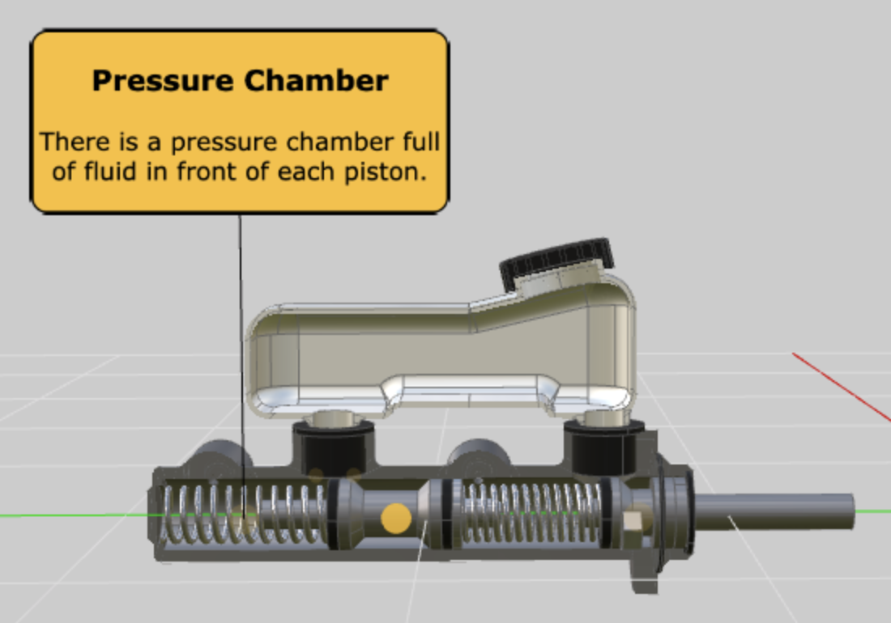

# Using Labels

## What is a label

A label is a piece of information about an item on the screen. They allow you to point to relevant parts of the scene.

## Some features of labels:

* Labels can display a wide variety of content, such as: Text, images, emojis, and other symbols.
* They can be [styled](tutorials/labels-styling) using [CSS](https://developer.mozilla.org/en-US/docs/Web/CSS).
* Labels support custom fonts.
* You can use any valid [HTML semantic element](https://developer.mozilla.org/en-US/docs/Glossary/Semantics#Semantics_in_HTML), such as: Titles, lists, paragraphs, etc.
* They can be [multilingual](tutorials/labels-multilingual).
* Labels can be [loaded](tutorials/labels-library) from other files like [TSV](https://en.wikipedia.org/wiki/Tab-separated_values), JSON, or even spreadsheets.

📷 Below: A yellow label pointing to a component (Pressure Chamber).

🎥 Labels live example:

<!-- Copy and Paste Me -->

  <iframe
    src="https://glitch.com/embed/#!/embed/zea-labels?path=index.html&previewSize=100&attributionHidden=true"
    title="zea-labels on Glitch"
    allow="geolocation; microphone; camera; midi; vr; encrypted-media"
    style="height: 100%; width: 100%; border: 0;">
  </iframe>

